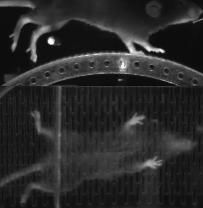

.. _multiview_fused:

####################################
Multiview: mirrored or fused frames
####################################

Mirrored frames
===============
A simple way to capture and store behavior from multiple views is to use a mirrored setup;
below is an example of a mouse running on a transparent treadmill captured from the side
and from below (Warren et al., Elife 2021).

Such a setup makes labeling and processing multiview data straighforward, and the Lightning Pose
software supports data in this format.

When labeling such data, each keypoint is treated independently; for example, the nose is tracked
using two separate keypoints, ``nose_top`` (top view) and ``nose_bot`` (bottom view).
The standard supervised approaches are not explicitly aware that these two keypoints are simply
two views of the same body part.

This information is utilized by Lightning Pose in the Multiview consistency loss applied to
unlabeled video data;
see the :ref:`Multiview consistency <unsup_loss_pcamv>` section for more information on how to
utilize this loss.

Fused frames
============
It is possible to achieve the same data format by fusing frames from multiple (synchronized!)
cameras after acquisition.
This approach makes labeling simpler, but there are several drawbacks:

* This does not easily scale beyond 2-4 views. As the number of views grows the resolution of the final fused image increases, and the networks may begin to assign high probability to keypoints on the wrong view.
* Inference on all new videos must also be run on fused frames, requiring an additional preprocessing step to fuse frames.

In the case of non-mirrored setups we recommend keeping the views separate;
see the :ref:`Multiview: separate data streams <multiview_separate>` section for more information.
